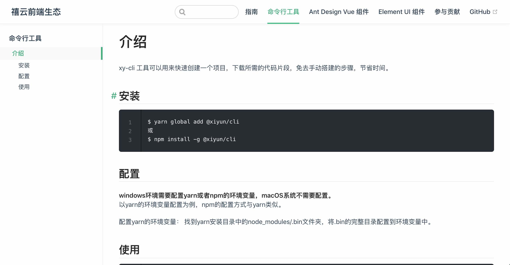

## 简介

vuepress-theme-xydocs 是禧云生态目前所用的一款文档主题，基于 vuepress 1.x 版本的默认主题做了一些样式上的调整。

## 预览



## 安装

首先，你需要下载 1.x 版的 vuepress：

```shell
$ yarn add -D vuepress@next
或
$ npm install -D vuepress@next
```

然后，在项目中下载本主题：

```shell
$ yarn add -D @xiyun/vuepress-theme-xydocs
$ npm install -D @xiyun/vuepress-theme-xydocs
```


## 配置

在 `.vuepress/config.js`中配置：

```js
theme: '@xiyun/vuepress-theme-xydocs'
```
